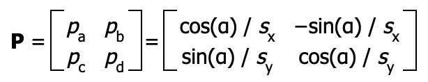

# 背景の伸縮回転

## オフセットレジスタ

```
0x0400_0028 - BG2X - BG2オフセットX(0-27bit) (W)
0x0400_002c - BG2Y - BG2オフセットY(0-27bit) (W)
0x0400_0038 - BG3X - BG3オフセットX(0-27bit) (W)
0x0400_003c - BG3Y - BG3オフセットY(0-27bit) (W)
```

これらのレジスタは、伸縮回転とビットマップモードにおいて、テキストモードにおけるBGスクロールレジスタの代わりに使用されます。

BGスクロールレジスタに入っている値は、伸縮回転とビットマップモードでは無視されます。

 bit |  内容
---- | ---- 
0-7   | 分数部分 (8 bits)
8-26  | 整数部分 (19 bits)
27    | 符号(1=負)
28-31 | 未使用

値は左に8つシフトされているので、端数部分は1/256ピクセル単位で指定することができます。 

例えば、0x12を設定したい時は、分数部分は0x00、整数部分は0x12にしたいのでレジスタには 0x12 << 8 を格納することになります。

符号付き32ビット値を上記のレジスタに書き込むことができますが、このとき最上位ビットは無視され、値は28ビットに切り捨てられます。

### 実際のオフセット

REG_BG2XとREG_BG2Yは、格納した値がそのまま画面上のBGのオフセットになるのでなく、後述の伸縮回転パラメータに影響されます。

BGが1/10に縮小される場合は、REG_BG2Xにセットした値の1/10だけ画面上で移動することになります。

また、BGが回転している場合は、回転したあとのBGの上下左右を基準に画像が移動します。

REG_BG2XとREG_BG2Yに格納する値の計算式は以下のようになります。

```
bgx = x1 - α×cos(θ-β)×hzoom
bgy = y1 - α×-sin(θ-β)×vzoom
```

変数 | 内容
-- | --
bgx, bgy | BGオフセットレジスタ
x1, y1 | BG面での回転の中心座標(x1,y1)
hzoom, vzoom | 横・縦の拡大率
θ | 回転の角度
α | (0,0)から(x1,y1)までの長さ α = sqrt(x1\*x1 + y1\*y1)
β | (0,0)から(x1,y1)までの角度 β = atan2(y1,x1)

## 伸縮回転パラメータ

```
0x0400_0020 - BG2PA - BG2 伸縮回転パラメータA (dx) (W)
0x0400_0022 - BG2PB - BG2 伸縮回転パラメータB (dmx) (W)
0x0400_0024 - BG2PC - BG2 伸縮回転パラメータC (dy) (W)
0x0400_0026 - BG2PD - BG2 伸縮回転パラメータD (dmy) (W)

0x0400_0030 - BG3PA - BG3 伸縮回転パラメータA (dx) (W)
0x0400_0032 - BG3PB - BG3 伸縮回転パラメータB (dmx) (W)
0x0400_0034 - BG3PC - BG3 伸縮回転パラメータC (dy) (W)
0x0400_0036 - BG3PD - BG3 伸縮回転パラメータD (dmy) (W)
```

 bit |  内容
---- | ---- 
0-7  | 分数部分 (8 bits)
8-14 | 整数部分 (7 bits)
15   | 符号 (1 bit)

伸縮回転パラメータは４つの数値（PA,PB,PC,PD）で指定します。

パラメータはI/OレジスタのREG_BG2PA～PDとREG_BG3PA～PDがあり、BG2用とBG3用に分かれています。

伸縮回転パラメータの4つの数値を組み合わせることで、伸縮や回転などさまざまな効果を出すことができます。

### dx(PA) と dy(PC)

水平方向の線を変換する場合、dxとdyはその線の勾配と倍率を指定します。

例えば、長さ100のx方向の直線(y=0x)が存在するときに`dx=1,dy=1`の変換をすると考えてみましょう。

このとき変換後は45度方向の直線(y=1x)となっています。

また直線の長さも変わっており、`sqrt(100^2+100^2)` つまり 141.42 となります。

### dmx (PB) と dmy (PD)

垂直方向の線を変換する場合、dmxとdmyはその線の勾配と倍率を指定します。

dmxとdmyは前述のdx,dyといっしょに指定されることが基本です。

たとえば、水平線と垂直線で囲まれた正方形の領域を回転させる場合、通常は(平行四辺形より)回転した正方形の領域が望ましい結果となります。

上の例(長さ100のx方向の直線,`dx=1,dy=1`)に加えて長さ100のy方向の直線がある場合は、`dmx=-1,dmy=1`としてやることで`x=-y`となり、正方形が反時計回りに45度回転することになります。

### 拡大縮小(伸縮)

今回は拡大縮小のための最小限の解説を行います。

このパラメータの基本(元と同じ画像を表示)は、PAから順番に256,0,0,256です。

拡大・縮小して表示したい場合は、縦の変化率がPAとPB、横の変化率が、PCとPDに一定の値をかけます。

かける値は倍率の逆数になります。つまり、2倍にして表示したい場合は2で割ればいいことになって、逆に1/2に表示したい場合は2をかけます。

倍率 | PA | PB | PC | PD 
-- | -- | -- | -- | -- 
200% | 128 | 0 | 0 | 128
100% | 256 | 0 | 0 | 256
50% | 512 | 0 | 0 | 512

### 回転

今回は回転機能を扱います。上記の4つのパラメータ(PA,PB,PC,PD)は、アフィン変換という方法が使われています。

アフィン変換は数学の行列が関係するのでここでは説明しません。より複雑なパラメータの組み合わせを試したい場合は、アフィン変換について調べるとわかりやすくなると思います。

画像を回転させるには、４つのパラメータを以下のように設定します。

パラメータ | 内容 
-- | -- 
PA | cos(angle)
PB | sin(angle)
PC | -sin(angle)
PD | cos(angle)

このように値をセットすればそれだけで元の画像を回転させた画像が表示されますが、C標準関数のsin,cosは浮動小数点用なのでそのまま使うには問題があります。

GBAのCPUでは浮動小数演算は非常に遅いので、処理速度の面で使いづらいです。GBAでsin、cosの値を利用したいときは、あらかじめ配列に整数のデータとして作成しておき、その配列から値を取得するようにすると速度の面で不安がなくなります。

## はみでた場合

変換の結果、画像がBGの外にはみ出てしまう場合の挙動はBGモードによってことなります。

BGモードが1,2のときは、[BG2CNT,BG3CNT](https://github.com/pokemium/gba_doc_ja/blob/main/lcd/bg_control.md)のbit13で、無視するかwrap(1周)するか指定することができます。

BGモードが3,4,5のときははみでた部分は無視されます。

## 変換後の座標計算

GBAでのアフィン変換は以下の行列を座標に対してかけることで行われます。



- `α`: 回転角度
- `Sx, Sy`: 拡大倍率

### 数式で現す場合

```
  x0,y0    => 回転の中心座標
  x1,y1    => 変換前の座標
  x2,y2    => 変換後の座標
  A,B,C,D  => pa, pb, pc, pd
```

```
  x2 = A(x1-x0) + B(y1-y0) + x0
  y2 = C(x1-x0) + D(y1-y0) + y0
```
