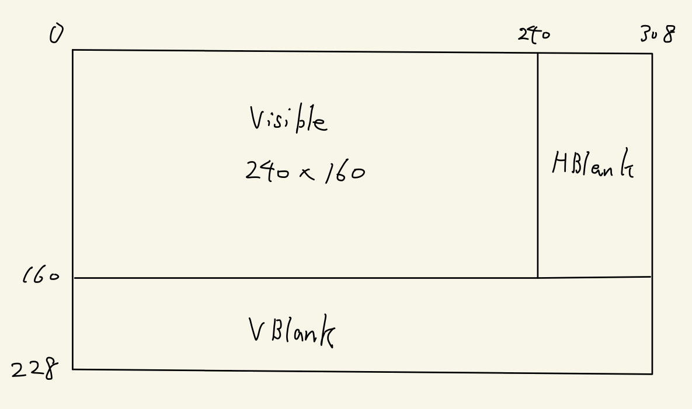

# 描画サイクル

GBAの画面描画は上から順に1行ずつやっていきます。

HBlank、VBlankも含めた画面の概略図は次のようになっています。



## 列の描画

現在描画中の行を左から右に1列(1ピクセル)ずつ描画していきます。

1ピクセル(=dot)描画するのにCPU時間で4サイクルかかります。

```
  Visible     240px, 57.221 us, 960サイクル
  HBlank      68px, 16.212 us, 272サイクル
  Total       308px, 73.433 us, 1232サイクル
```

VRAMとPaletteにはHBlank中のみアクセス可能です。OAMはHBlank中に加えて、DISPCNTのbit5がセットされているときのみアクセス可能です。

## 行の描画

1行を描画し終えたら次の行の描画に写ります。行の描画は上から下へと行われます。

```
  Visible (*) 160行, 11.749 ms, 197120サイクル
  VBlank      68行,  4.994 ms,  83776サイクル
  Total       228行, 16.743 ms, 280896サイクル
```

VBlank中はVRAM,OAM,Palette全てにアクセス可能です。

VBlank中(160\~228行)は、240\~308pxのHBlank期間に入ってもHBlank割り込みは発生しません。

(*) 縦画面のサイズは160px(160行)ですが、上の8pxは実際には見えません。これらの行は、光源に向けてGBAを持っているときに影に覆われています。これらの行は事実上黒です。そして、重要な情報を表示するために使用するべきではありません。

## System Clock

CPUのクロックは 16.78MHz(16×1024×1024Hz) なので、1フレームあたり約1/60秒です。
